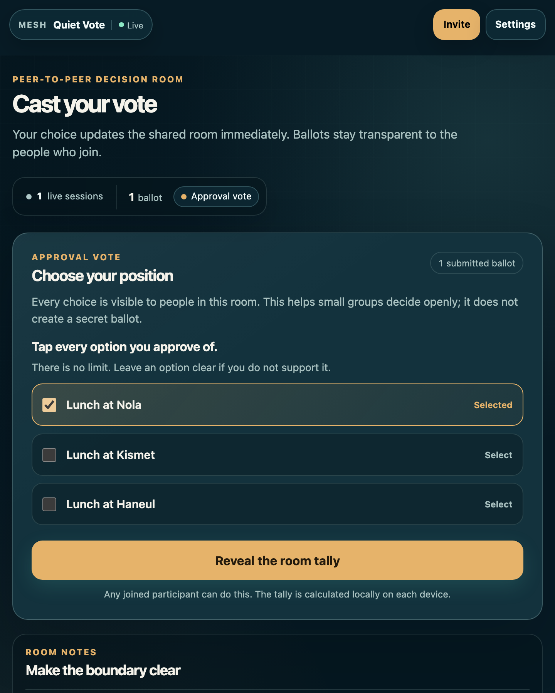
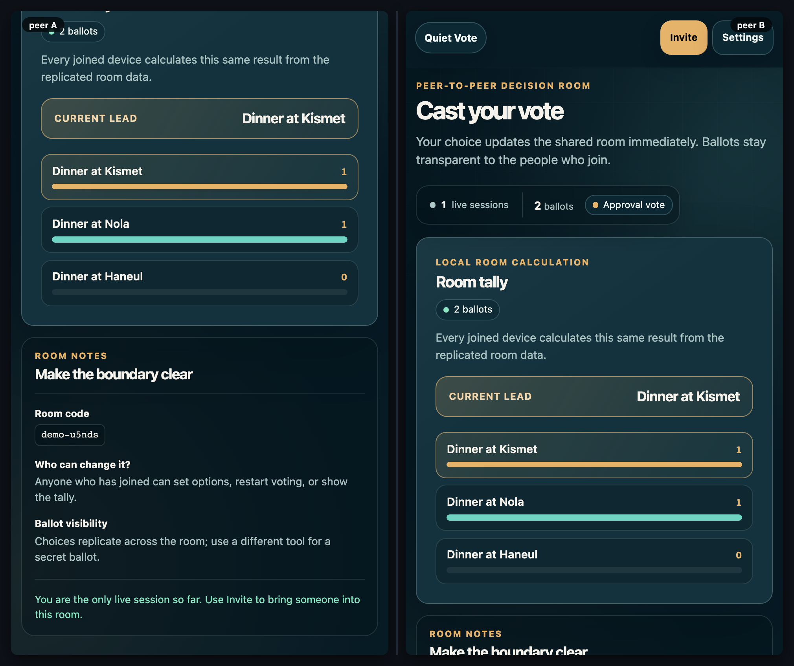

# Quiet Vote

[](https://baditaflorin.github.io/mesh-silent-vote/)
[](LICENSE)
[](docs/adr/0001-deployment-mode.md)

> A calm room for transparent ranked, approval, and score decisions — shared directly between the people in the room.

**Live → https://baditaflorin.github.io/mesh-silent-vote/**



## Start a decision

1. Open the live link on your device and select **Enter this decision room**.
2. Set at least two options and choose approval, ranked choice, or score voting.
3. Use **Invite** to bring the rest of the group into the same room.
4. Each person responds on their own device; anyone in the room can reveal the locally calculated tally.

There is no host role and no application backend storing the decision. The room data is replicated through Yjs and WebRTC between joined browsers.

## What this is — and is not

Quiet Vote is intentionally clear about its boundary:

- **Good for:** transparent team, family, workshop, and small-group decisions.
- **Not a secret ballot:** submitted choices replicate to every peer in the room.
- **Not anonymous:** do not use it for confidential, coercion-sensitive, or high-stakes voting.
- **Room link = access:** share the invitation deliberately.

See [the full privacy model](docs/privacy.md) before using it with real people.

## A real two-peer flow



The checked end-to-end flow opens two peers in one room, creates a round, submits distinct ballots, and verifies that the same aggregate approval, score, and instant-runoff tally appears on both screens. It runs without a signaling server in test mode through the browser's BroadcastChannel fallback.

## Voting modes

- **Approval** — choose every option you support.
- **Ranked choice** — put options in order; the tally uses deterministic instant-runoff voting (Hare), including a documented tie-break.
- **Score** — rate every option from 0 to 10; the tally shows the shared mean.

## Run locally

```bash
git clone https://github.com/baditaflorin/mesh-common
git clone https://github.com/baditaflorin/mesh-silent-vote
cd mesh-silent-vote
npm ci
npm run dev
```

`mesh-common` must be a sibling directory because this app consumes it through `file:../mesh-common`.

## Quality checks

```bash
npm run fmt:check
npm run typecheck
npm run test
npm run smoke
MESH_LEAK_DURATION_MS=5000 MESH_LEAK_NOISE_OPS=25 npm run test:leak
npm run audit:security
npm audit --audit-level=high
```

`npm run screenshot` refreshes the single-screen product view. `npm run demo` records the side-by-side two-peer GIF and preview used by the Mesh demo catalog.

## Deployment and architecture

GitHub Pages serves the committed `docs/` directory on `main`; there are no GitHub Actions workflows. Repository validation runs through the self-hosted Woodpecker pipeline defined in [`.woodpecker.yml`](.woodpecker.yml).

- [Deployment mode](docs/adr/0001-deployment-mode.md)
- [Voting modes](docs/adr/0002-voting-modes.md)
- [Instant-runoff details](docs/adr/0003-irv-details.md)
- [Pages publishing strategy](docs/adr/0010-pages-publishing.md)
- [Security audit](docs/security-audit.md)

## License

MIT — see [LICENSE](LICENSE).
